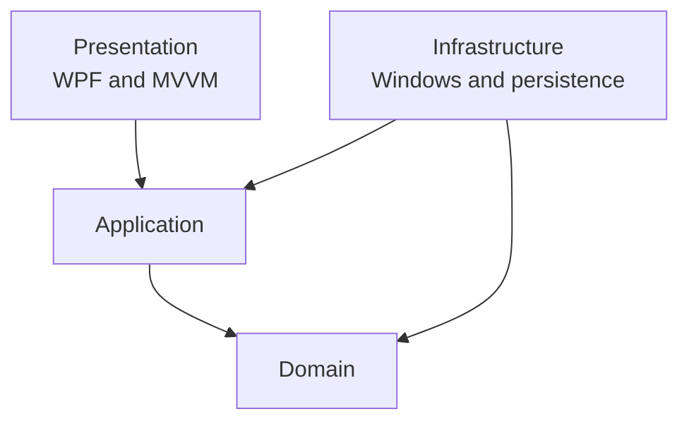
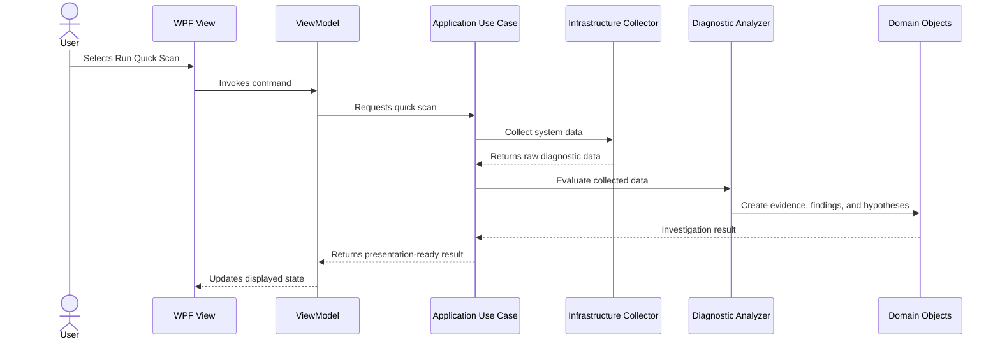
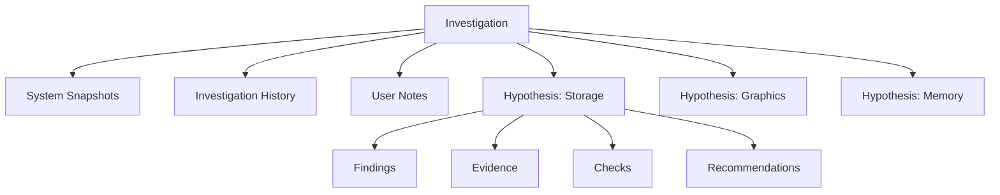

# Architecture

## Purpose

This document defines the intended software architecture of PC Diagnostic Assistant.

The architecture should support the application's core purpose: collecting diagnostic information, organising investigations, evaluating evidence, and guiding users through structured troubleshooting workflows.

The design aims to make the application:

* Maintainable.
* Testable.
* Extensible.
* Understandable to contributors.
* Suitable for incremental development.
* Independent of individual Windows diagnostic technologies wherever practical.

The architecture is intentionally pragmatic. It borrows ideas from Clean Architecture, layered architecture, and Domain-Driven Design without attempting to implement every pattern associated with them.

The project will begin with only the separation needed to protect the core diagnostic logic and support future growth.

---

# Architectural Goals

The architecture should make the following possible:

* Add a new diagnostic check without changing the user interface significantly.
* Add a new guided investigation without rewriting existing workflows.
* Replace one Windows data source with another without changing the domain model.
* Test diagnostic reasoning without requiring access to real hardware.
* Save and reopen investigations.
* Re-run checks and compare results over time.
* Export investigation information without coupling report generation to the UI.
* Clearly distinguish observed evidence from interpreted conclusions.
* Prevent presentation code from becoming responsible for diagnostic logic.

---

# Non-Goals

The initial architecture will not attempt to support:

* Third-party plugins.
* Multiple operating systems.
* Cloud synchronisation.
* Remote PC management.
* Distributed services.
* A web-based frontend.
* Automated repairs.
* A fully generic workflow engine.

These may be reconsidered in the future, but designing for them now would add complexity without helping the first version.

---

# Architecture Style

PC Diagnostic Assistant will use a layered architecture with ideas taken from Clean Architecture.

The user interface will follow the Model-View-ViewModel pattern.

The application will be divided into four main projects:

1. Domain
2. Application
3. Infrastructure
4. Presentation

The Domain and Application projects form the core of the software.

Infrastructure and Presentation are implementation details around that core.

---

# Dependency Direction

Source-code dependencies should point towards the centre of the application.



The key dependency rule is:

> The Domain must not depend on Presentation, Infrastructure, Windows APIs, WPF, or persistence technologies.

This means the core diagnostic concepts remain usable and testable without launching the desktop application or accessing the local machine.

---

# Runtime Interaction

Although Infrastructure depends on Application at the source-code level, the Application layer uses Infrastructure services at runtime through interfaces.

For example:



This is sometimes called dependency inversion.

The Application layer defines what capabilities it needs. Infrastructure provides the Windows-specific implementations.

---

# Layer Responsibilities

## Domain

The Domain project contains the central language and rules of PC Diagnostic Assistant.

It represents diagnostic concepts without knowing how system data was collected or how results will be displayed.

The Domain may contain:

* Investigations.
* Hypotheses.
* Findings.
* Evidence.
* Recommendations.
* Diagnostic check results.
* System snapshots.
* Confidence levels.
* Priority levels.
* Investigation states.
* Domain rules governing valid state changes.

Examples of domain rules include:

* A hypothesis cannot be marked as ruled out without a recorded reason.
* Evidence must remain distinct from interpretation.
* A resolved investigation should record an outcome.
* Confidence levels may change when new evidence or user test results are added.
* Critical findings must remain visible even when unrelated to the original symptom.

The Domain must not contain:

* WPF classes.
* ViewModels.
* Event Viewer access.
* WMI queries.
* File-system operations.
* Database access.
* HTTP requests.
* Logging configuration.
* Windows-specific data types.

### Domain design principle

The Domain should describe diagnostic reasoning, not the Windows APIs used to support it.

For example, the Domain may understand:

```text
Repeated storage communication warnings were detected.
```

It should not need to understand:

```text
System.Diagnostics.Eventing.Reader.EventLogReader
```

---

## Application

The Application project defines what the application can do.

It coordinates workflows and uses Domain objects to represent the result.

The Application layer may contain:

* Use cases.
* Workflow coordinators.
* Service interfaces.
* Data-transfer models where needed.
* Validation of application requests.
* Investigation orchestration.
* Confidence recalculation.
* Scan coordination.
* Session loading and saving workflows.
* Report export workflows.

Example use cases include:

* Run Quick Health Check.
* Run Full Diagnostic.
* Start Guided Investigation.
* Add User Test Result.
* Re-evaluate Hypothesis.
* Re-run Diagnostic Check.
* Save Investigation.
* Reopen Investigation.
* Export Investigation Report.

The Application layer should decide the order in which work occurs.

For example:

```text
1. Create an investigation.
2. Capture a system snapshot.
3. Run the selected diagnostic checks.
4. Collect evidence.
5. Generate findings.
6. Create or update hypotheses.
7. Generate recommendations.
8. Save the investigation.
9. Return the result.
```

The Application layer must not know how WPF renders a screen or how Event Viewer is queried.

### Interfaces

Interfaces that represent capabilities required by an application workflow should normally be declared in the Application project.

Examples may include:

```text
ISystemSnapshotCollector
IEventLogCollector
IStorageDiagnosticsCollector
IInvestigationRepository
IReportExporter
ISystemClock
```

Infrastructure will implement these interfaces.

This lets Application logic be tested using controlled test implementations rather than the real Windows machine.

---

## Infrastructure

The Infrastructure project handles communication with Windows, hardware interfaces, storage mechanisms, and other external systems.

It may contain:

* Windows Event Log readers.
* WMI or CIM queries.
* Performance data collectors.
* Storage information collectors.
* Network diagnostic services.
* Hardware sensor integrations.
* Investigation persistence.
* File export implementations.
* Logging providers.
* Operating-system information providers.

Infrastructure is responsible for obtaining data reliably.

It should not decide what that data ultimately means for an investigation.

For example:

Infrastructure may report:

```text
Event ID: 153
Source: Disk
Occurrences: 8
Time range: 7 days
```

It should not independently conclude:

```text
The NVMe drive is failing.
```

Interpretation belongs in diagnostic logic coordinated by the Application layer and represented by the Domain.

### Handling platform limitations

Some diagnostic information may be:

* Unavailable.
* Restricted.
* Hardware-dependent.
* Unsupported by a vendor.
* Accessible only with elevated permissions.
* Inconsistent across Windows versions.

Infrastructure should return explicit outcomes rather than hiding these limitations.

For example:

```text
Success
Unavailable
Unsupported
PermissionDenied
TimedOut
Failed
```

Missing data must not automatically be treated as healthy data.

---

## Presentation

The Presentation project is the WPF desktop application.

It is responsible for:

* Windows and pages.
* Views.
* ViewModels.
* Commands.
* Navigation.
* User input.
* Displaying progress.
* Displaying errors.
* Presenting investigations and reports.
* UI-specific state.

The Presentation layer will use MVVM to reduce logic in code-behind.

### View

A View defines what the user sees.

It should contain layout, bindings, templates, and visual behaviour.

### ViewModel

A ViewModel prepares application data for the View and responds to user actions.

A ViewModel may:

* Expose displayable data.
* Track loading state.
* Validate basic user input.
* Invoke Application use cases.
* Translate application outcomes into UI state.
* Expose commands.

A ViewModel should not:

* Query Event Viewer.
* Read hardware sensors.
* Calculate diagnostic confidence directly.
* Write report files itself.
* Construct SQL queries.
* Contain substantial diagnostic rules.

### Code-behind

Code-behind should be limited to behaviour that is genuinely specific to WPF controls or the window lifecycle.

Business and diagnostic logic should not be placed in code-behind.

---

# Proposed Solution Structure

```text
PCDiagnosticAssistant/
│
├── src/
│   ├── PCDiagnosticAssistant.App/
│   ├── PCDiagnosticAssistant.Application/
│   ├── PCDiagnosticAssistant.Domain/
│   └── PCDiagnosticAssistant.Infrastructure/
│
├── tests/
│   ├── PCDiagnosticAssistant.Domain.Tests/
│   ├── PCDiagnosticAssistant.Application.Tests/
│   └── PCDiagnosticAssistant.Infrastructure.Tests/
│
├── docs/
│   ├── product-vision.md
│   ├── domain-model.md
│   ├── architecture.md
│   ├── design-principles.md
│   └── roadmap.md
│
├── README.md
├── LICENSE
└── .gitignore
```

An Infrastructure test project may be introduced when the first external integrations are implemented. It does not have to be created before it provides value.

---

# Expected Project References

The intended project references are:

```text
PCDiagnosticAssistant.App
├── PCDiagnosticAssistant.Application
└── PCDiagnosticAssistant.Infrastructure

PCDiagnosticAssistant.Infrastructure
├── PCDiagnosticAssistant.Application
└── PCDiagnosticAssistant.Domain

PCDiagnosticAssistant.Application
└── PCDiagnosticAssistant.Domain

PCDiagnosticAssistant.Domain
└── No project references
```

The App project references Infrastructure so it can register concrete service implementations during application startup.

ViewModels should still communicate through Application interfaces and use cases rather than directly invoking Infrastructure classes.

---

# Dependency Injection

Dependency injection will be used to connect interfaces to their implementations.

For example:

```text
Application requires:
IEventLogCollector

Infrastructure provides:
WindowsEventLogCollector
```

The WPF startup project will configure that relationship.

Dependency injection is useful here because it:

* Keeps object creation out of business logic.
* Makes dependencies visible.
* Supports testing with substitute implementations.
* Allows Windows integrations to be changed independently.
* Reduces tight coupling.

Dependency injection should not be used merely to create an interface for every class.

Interfaces should be introduced when they represent a meaningful boundary, allow interchangeable implementations, or improve testability.

---

# Diagnostic Processing Model

The first iteration will follow this general pipeline:

```mermaid
flowchart LR
    Request["Scan or Investigation Request"]
    Collection["Collect Raw Data"]
    Checks["Run Diagnostic Checks"]
    Evidence["Create Evidence"]
    Findings["Generate Findings"]
    Hypotheses["Create or Update Hypotheses"]
    Recommendations["Generate Recommendations"]
    Persistence["Save Investigation"]
    Results["Return Results"]

    Request --> Collection
    Collection --> Checks
    Checks --> Evidence
    Evidence --> Findings
    Findings --> Hypotheses
    Hypotheses --> Recommendations
    Recommendations --> Persistence
    Persistence --> Results
```



Each stage has a separate responsibility.

## Raw data

Technical information returned by Windows or hardware integrations.

Example:

```text
Event ID 153 occurred eight times during the selected period.
```

## Evidence

A factual diagnostic record stored in the investigation.

Example:

```text
Eight storage reset events were recorded in the last seven days.
```

## Finding

A user-understandable observation based on one or more pieces of evidence.

Example:

```text
Repeated storage warnings were detected.
```

## Hypothesis

A possible explanation based on the current findings.

Example:

```text
A storage communication problem may be contributing to system instability.
```

## Recommendation

A safe next area to investigate.

Example:

```text
Consider checking the drive connection, motherboard slot, storage driver, and firmware. Back up important data before further testing.
```

---

# Investigation Model

An Investigation acts as the coordinator for one reported problem.



The Investigation represents the overall question:

```text
Why does this PC lose visual output while remaining partially responsive?
```

Each Hypothesis represents a possible answer:

```text
Possible storage communication issue.
Possible graphics instability.
Possible memory instability.
```

A hypothesis may be strengthened, weakened, or ruled out without losing its history.

---

# Persistence Boundary

Investigations must eventually be saved and reopened.

The Application layer will work with an abstraction such as an investigation repository.

The storage technology will be selected separately and treated as an Infrastructure concern.

Possible implementations include:

* JSON files.
* SQLite.
* Another local persistence mechanism.

The architecture does not currently require a final persistence choice.

The first persistence implementation should prioritise:

* Reliability.
* Ease of inspection during development.
* Simple backups.
* Support for evolving investigation data.
* Minimal deployment complexity.

A formal decision should be recorded before implementation begins.

---

# Error Handling

Errors should be handled at the layer where meaningful context can be added.

## Infrastructure errors

Infrastructure should convert low-level exceptions into meaningful outcomes.

For example:

```text
UnauthorizedAccessException
```

may become:

```text
Event log access was denied.
```

Infrastructure should not silently discard failures.

## Application errors

The Application layer should decide whether a failed operation:

* Stops the workflow.
* Produces incomplete results.
* Can be retried.
* Should be recorded as unavailable evidence.
* Requires user action.

## Presentation errors

The Presentation layer should show errors in clear language and offer an appropriate next step.

Technical exceptions should be logged rather than displayed directly to users.

---

# Logging

Logging should capture enough information to diagnose application failures without collecting unnecessary personal information.

Logs may include:

* Workflow start and completion.
* Diagnostic check start and completion.
* Check duration.
* Integration failures.
* Permission failures.
* Unexpected exceptions.
* Persistence failures.

Logs should not unnecessarily include:

* User documents.
* Passwords.
* Product keys.
* Full command histories.
* Sensitive network credentials.
* Personal information unrelated to diagnosis.

Diagnostic reports and application logs are separate concepts.

---

# Asynchronous Work

Diagnostic operations may take time and should not freeze the user interface.

Operations such as these should be asynchronous where appropriate:

* Reading Event Viewer.
* Collecting system information.
* Running network diagnostics.
* Saving investigations.
* Exporting reports.
* Performing full scans.

Long-running operations should support:

* Progress reporting where meaningful.
* Cancellation where safe.
* Timeouts for external operations.
* Clear partial-failure handling.

Using asynchronous code does not mean every method should automatically be marked asynchronous. It should be used where operations wait for external resources or may block the UI.

---

# Testing Strategy

## Domain tests

Domain tests will validate diagnostic rules and state transitions.

Examples:

* An investigation cannot be resolved without an outcome.
* Adding supporting evidence may strengthen a hypothesis.
* Ruled-out hypotheses remain in investigation history.
* Critical findings receive appropriate priority.
* Evidence cannot be recorded without a source.

## Application tests

Application tests will validate use-case behaviour.

Examples:

* A Quick Health Check requests the correct collectors.
* A failed collector does not necessarily stop the entire scan.
* User test results trigger re-evaluation.
* An investigation is saved after meaningful changes.
* Report export receives the correct investigation data.

These tests should use controlled substitutes for Infrastructure services.

## Infrastructure tests

Infrastructure tests will validate Windows integrations and persistence.

These may require:

* Windows-specific test environments.
* Integration-test categories.
* Carefully selected fixture data.
* Manual testing for hardware-dependent features.

Not all operating-system integrations need traditional unit tests. Thin wrappers may be better covered by integration tests and strong error handling.

---

# First Vertical Slice

The first implementation should not attempt to build the complete application layer by layer.

Instead, it should implement one small feature through every layer.

The recommended first vertical slice is:

> Run a basic Quick Health Check and display a saved result.

The initial slice may:

1. Accept a Quick Health Check request from the UI.
2. Collect a small system snapshot.
3. Run one or two simple checks.
4. Produce evidence.
5. Produce a finding.
6. Create a low-risk hypothesis or health observation.
7. Display the result.
8. Save enough information to prove the workflow.

A suitable first check might be low storage capacity because it is:

* Easy to reproduce.
* Safe to inspect.
* Simple to explain.
* Supported by standard .NET and Windows information.
* Useful for exercising the complete architecture.

This vertical slice will validate the architecture before more difficult integrations such as Event Viewer, SMART information, or hardware temperatures are introduced.

---

# Architectural Decision Records

Important decisions should be recorded as short Architectural Decision Records, or ADRs.

An ADR explains:

* The decision.
* The context.
* Alternatives considered.
* Why the selected option was chosen.
* Consequences of the decision.

Potential early ADRs include:

```text
ADR-001: Use WPF for the desktop interface
ADR-002: Use layered Clean Architecture-lite
ADR-003: Choose local investigation persistence
ADR-004: Choose the first system data collection approach
ADR-005: Represent confidence using named levels rather than percentages
```

ADRs prevent important decisions from existing only in memory or commit history.

They can be stored under:

```text
docs/decisions/
```

---

# Rules for Adding New Features

When adding a feature, contributors should ask:

1. Is this a Domain concept, an Application workflow, an Infrastructure integration, or Presentation behaviour?
2. Does it strengthen the diagnostic workflow?
3. Does it introduce a dependency pointing in the wrong direction?
4. Can its reasoning be tested without accessing real hardware?
5. Does it preserve the distinction between evidence, findings, hypotheses, and recommendations?
6. Does it create an unsafe repair capability?
7. Is the complexity justified by the current milestone?

These questions should be answered before adding new architectural abstractions.

---

# Known Design Decisions Still Required

The following decisions are intentionally not finalised in this document:

* Exact .NET version.
* Persistence technology.
* MVVM supporting library or custom implementation.
* Windows diagnostic APIs used by each collector.
* Report file formats.
* Elevated-permission strategy.
* Hardware sensor library.
* Packaging and installer technology.

These decisions should be made when the relevant milestone approaches, not prematurely.

---

# Summary

PC Diagnostic Assistant will separate diagnostic concepts, workflow coordination, external Windows integrations, and the user interface into clearly defined architectural boundaries.

The most important architectural rule is:

> Windows-specific and UI-specific details must not control the core diagnostic model.

The architecture should be judged by whether it helps the project add useful diagnostic capabilities safely and incrementally, not by how many patterns or abstractions it contains.
